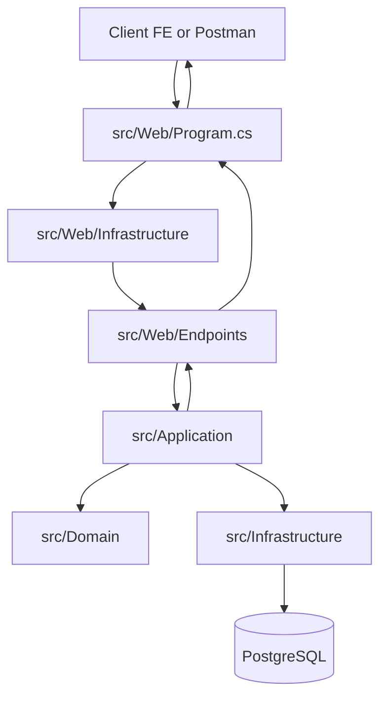

# Request Flow By Folders

Tai lieu nay mo ta mot HTTP request di qua cac folder trong solution nhu the nao.

## 1. Tong quan luong request

## 2. Diem vao request

- Folder: src/Web
- File chinh: src/Web/Program.cs
- Nhiem vu:
  - Khoi tao middleware pipeline (CORS, exception handler, OpenAPI, static files).
  - Map endpoint groups qua Web infrastructure.

## 3. Web Infrastructure xu ly API-level concerns

- Folder: src/Web/Infrastructure
- Nhiem vu:
  - Tu dong quet va map endpoint groups.
  - Chuan hoa operation metadata cho OpenAPI.
  - Chuyen exception thanh ProblemDetails de response dong nhat.
- File tieu bieu:
  - src/Web/Infrastructure/WebApplicationExtensions.cs
  - src/Web/Infrastructure/IEndpointGroup.cs
  - src/Web/Infrastructure/EndpointRouteBuilderExtensions.cs
  - src/Web/Infrastructure/ProblemDetailsExceptionHandler.cs

## 4. Endpoint nhan request va goi use-case

- Folder: src/Web/Endpoints
- Nhiem vu:
  - Nhap request tu HTTP.
  - Goi use-case qua MediatR (command/query).
  - Tra response ve HTTP.
- Nguyen tac:
  - Khong dat business logic o day.

## 5. Application xu ly use-case

- Folder: src/Application
- Nhiem vu:
  - Chua command/query/handler cho nghiep vu.
  - Chay pipeline behaviours (validation, logging, performance, exception).
  - Goi qua IApplicationDbContext de truy cap du lieu.
- File tieu bieu:
  - src/Application/DependencyInjection.cs
  - src/Application/Common/Behaviours/*
  - src/Application/Common/Interfaces/IApplicationDbContext.cs

## 6. Domain giu luat nghiep vu cot loi

- Folder: src/Domain
- Nhiem vu:
  - Dinh nghia entity/value object/domain rules.
  - Khong phu thuoc Web, Infrastructure, EF Core.
- Hien trang:
  - Dang la skeleton, san sang them entity nghiep vu that.

## 7. Infrastructure xu ly persistence va external concerns

- Folder: src/Infrastructure
- Nhiem vu:
  - Trien khai persistence voi EF Core.
  - Cau hinh DbContext, interceptors, database initialization.
- File tieu bieu:
  - src/Infrastructure/DependencyInjection.cs
  - src/Infrastructure/Data/ApplicationDbContext.cs
  - src/Infrastructure/Data/Interceptors/*

## 8. Ket qua tra ve client

- Flow nguoc:
  - Infrastructure tra data cho Application.
  - Application tao result/DTO.
  - Web Endpoint doi thanh HTTP response.
  - Program pipeline tra response ve client.

## 9. Cac folder ho tro

- src/AppHost:
  - Orchestration local dev, noi Web voi DB service.
- src/ServiceDefaults:
  - Cau hinh dung chung cho telemetry, health checks, resilience.
- src/Shared:
  - Hang so dung chung giua cac project (ten services, ten DB).

## 10. Quy tac implement de dung flow

1. Request chi vao qua Web.
2. Web chi mapping va orchestration, khong xu ly nghiep vu.
3. Business logic nam o Application va Domain.
4. Persistence/DB nam o Infrastructure.
5. Domain khong tham chieu framework.
